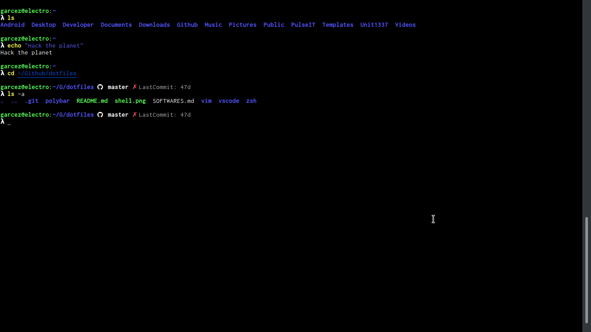

# Awesome Shell

This is a repository with all dotfiles to making a power and awesome Shell



## Requirements

* [Oh-My-Zsh](https://github.com/robbyrussell/oh-my-zsh)
* [Zplug](https://github.com/zplug/zplug)
* [Colorls](https://github.com/jonasjacek/colors)
* [Nerd-Fonts](https://github.com/ryanoasis/nerd-fonts)
* [Icons-in-terminal](https://github.com/sebastiencs/icons-in-terminal)
* [Vim Devicons](https://github.com/ryanoasis/vim-devicons)
* [Powerlevel9k](https://github.com/bhilburn/powerlevel9k)
* [MyCli](https://github.com/dbcli/mycli)

## Making your Awesome Shell

First, you need install all requirements to build it. Starting with "Oh-My-Zsh":

```bash
sh -c "$(curl -fsSL https://raw.githubusercontent.com/robbyrussell/oh-my-zsh/master/tools/install.sh)"
git clone https://github.com/bhilburn/powerlevel9k.git ~/.oh-my-zsh/custom/themes/powerlevel9k
```

Now, just clone repo and copy files to $HOME

```bash
git clone https://github.com/vandalvnl/dotfiles /tmp/dotfiles
cat /tmp/dotfiles/zsh/zshrc > $HOME/.zshrc
cat /tmp/dotfiles/zsh/master_alias.zsh > $HOME/.zsh/master_alias.zsh
cat /tmp/dotfiles/zsh/master_themes.zsh > $HOME/.zsh/master_themes.zsh
cat /tmp/dotfiles/zsh/master_functions.zsh > $HOME/.zsh/master_functions.zsh
```

**Good...**
Shell: Zsh

Theme: Powerlevel 9k

Functions: A little touch of [vandalvnl](https://vandalvnl)
