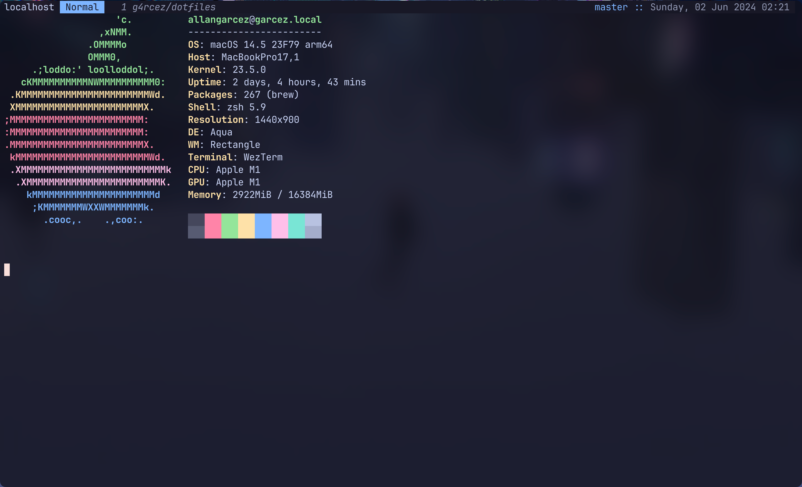
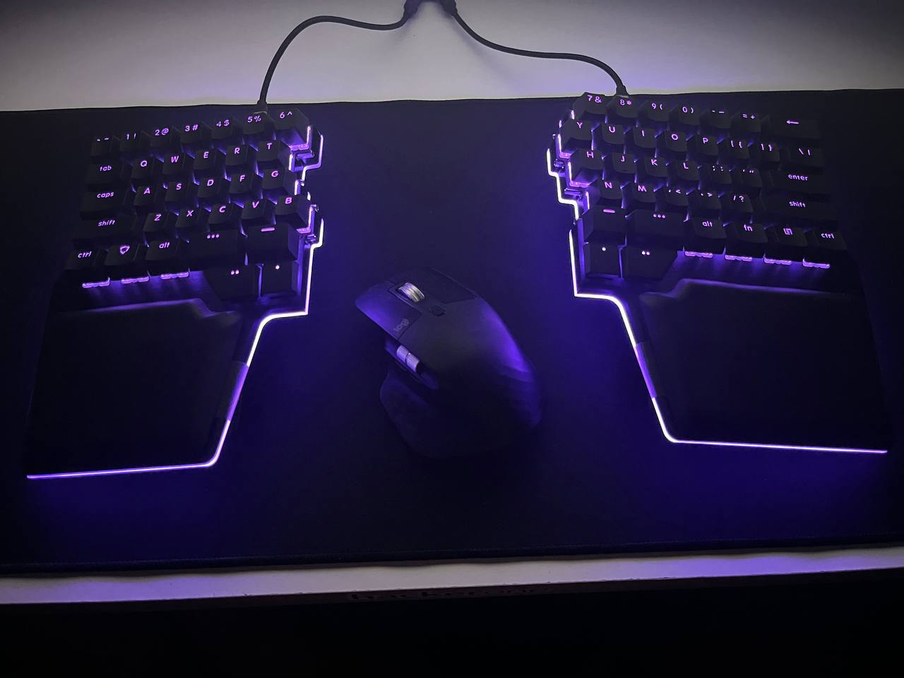

# dotfiles

Hi. This is my dotfiles project. Here you will find all my configs to create an awesome shell.

# Know the dotfiles

| File                                                                          | Purpose                                         |
|-------------------------------------------------------------------------------|-------------------------------------------------|
| [zsh/zshrc](https://github.com/g4rcez/dotfiles/blob/master/zsh/zshrc)         | Entrypoint of all my ZShell configs             |
| [git/gitconfig](https://github.com/g4rcez/dotfiles/blob/master/git/gitconfig) | Gitconfig settings. Alias, core, diff style     |
| [starship.toml](https://github.com/g4rcez/dotfiles/blob/master/starship.toml) | Configure of [starship.rs](https://starship.rs) |

# Useful CLI

- [fzf](https://github.com/junegunn/fzf)
- [lunarvim](https://www.lunarvim.org/)
- [oh-my-zsh](https://ohmyz.sh/)
- [starship.rs](https://starship.rs)
- [bat](https://github.com/sharkdp/bat)
- [diff-so-fancy](https://github.com/so-fancy/diff-so-fancy)

# Useful softwares

- [espanso](https://espanso.org/)
- [karabiner](https://karabiner-elements.pqrs.org/index.html) - replace CapsLock to Esc
- [raycast](https://www.raycast.com/)



# How to install?

First, check the requirements:

- zsh > v4
- git > v2

If this ok, you can install the `oh-my-zsh` and download the dotfiles

```bash
sh -c "$(curl -fsSL https://raw.githubusercontent.com/robbyrussell/oh-my-zsh/master/tools/install.sh)"

git clone https://github.com/g4rcez/dotfiles $HOME/dotfiles
cd $HOME/dotfiles
bash install.sh
```

# My Keyboard


