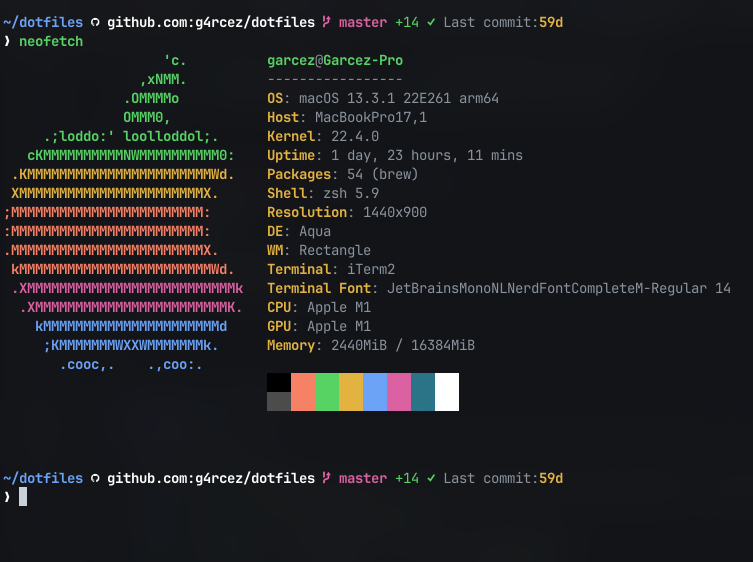
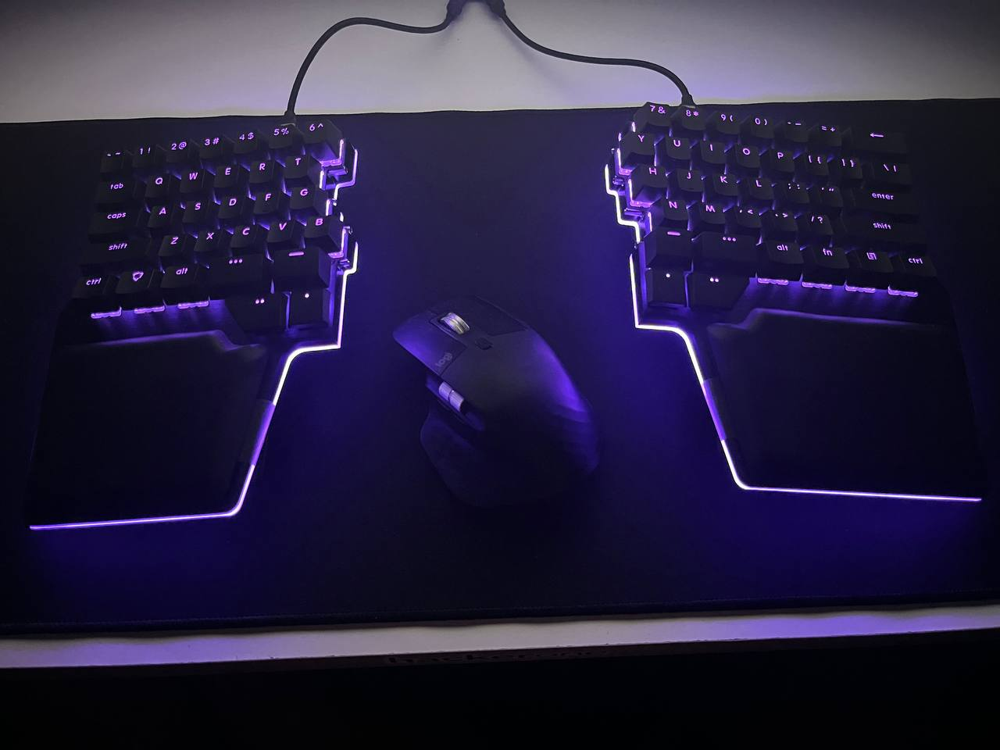

# dotfiles

Personal, macOS-first development environment for daily software work. This repository keeps my shell, terminal, editor, keyboard, window-management, text-expansion, and command-line workflows in one place.

The setup is opinionated and designed for my machines. TypeScript and Bun, together with [`@g4rcez/bunsen`](https://github.com/g4rcez/bunsen), handle deployment. The behavior lives in the zsh, Lua, TOML, JSON, and standalone script files under this repository.



## What is included

- **Zsh** — znap plugins, Starship, fzf, zoxide, mise, direnv, custom completions, Git helpers, and startup diagnostics.
- **Neovim** — lazy.nvim, LSP, completion, Treesitter, Snacks, formatting, linting, debugging, HTTP tools, and GitHub integration. See [`config/nvim/README.md`](config/nvim/README.md).
- **Terminals and sessions** — Ghostty as the primary terminal, WezTerm as an alternative, tmux as the active multiplexer, optional Zellij support, and Yazi for file management.
- **macOS automation** — Karabiner Elements, Aerospace, Raycast, Espanso, and application shortcuts.
- **Developer tools** — Git with delta and SSH signing, mise-managed runtimes, Homebrew packages, and configuration for Zed, VS Code, IntelliJ IDEA Vim, Kitty, Alacritty, Posting, Lazygit, and other CLI tools.
- **Agent workflow** — the tmux-native [`agentmux`](agentmux/) dashboard, Pi lifecycle status integration, helper scripts, and prompts.

## Quick reference

- Hold **Caps Lock** for the Hyper key (`Control` + `Option` + `Shift` + `Command`); tap it for Escape.
- **Hyper + `h`/`j`/`k`/`l`** sends arrow keys.
- **Command + `P`** is the terminal leader in Ghostty and WezTerm for tabs, splits, pane navigation, and reloads.
- **Control + `P`** is the tmux prefix.
- Espanso matches use the **`;`** prefix, for example `;date`, `;time`, `;uuid`, `;hex`, and `;rgb`.
- Neovim uses **Space** as its leader key.

## Repository layout

```text
dotfiles/
├── dotfiles.config.ts       # Bunsen deployment config, environment, and symlink map
├── install                   # Conservative bootstrap script
├── Brewfile                  # Homebrew formulae and casks
├── .tool-versions            # Runtime versions managed by mise
├── bunsen/                   # Generated Karabiner and Espanso profiles
├── config/                   # Application and shell configuration
│   ├── zsh/                  # zsh entrypoint, modules, aliases, and completions
│   ├── nvim/                 # Neovim configuration
│   ├── ghostty/ wezterm/     # Terminal configurations
│   ├── tmux/ zellij/         # Multiplexer configurations
│   ├── aerospace/            # macOS window management
│   ├── vscode/ zed/ idea/   # Editor configurations
│   ├── git/                  # Git configuration and global ignore rules
│   ├── pi/ claude/           # Assistant and agent integrations
│   └── ...                   # Yazi, Lazygit, Posting, Kitty, and other tools
├── bin/                      # Standalone shell, TypeScript, and utility scripts
├── agentmux/                 # Rust tmux dashboard for coding agents
├── espanso/                  # Runtime helpers used by Espanso matches
├── raycast/                  # Raycast extensions
├── snippets/                 # Reusable snippets
├── prompts/                  # Prompt templates
└── tests/                    # Shell, Bun, and agent integration tests
```

`dotfiles.config.ts` is the source of truth for deployment. A directory under `config/` is not deployed just because it exists; add its destination to the `symlinks` map when it should be managed. The current configuration targets `~/dotfiles` and defines an `osx` profile for the Karabiner and Espanso integrations. Some Linux-specific configurations are kept in the repository but are not part of that default profile.

## Installation

The deployment is deliberately split into bootstrap and apply steps. Clone to `~/dotfiles`, which is the path used by [`dotfiles.config.ts`](dotfiles.config.ts):

```bash
git clone https://github.com/g4rcez/dotfiles "$HOME/dotfiles"
cd "$HOME/dotfiles"

# Install the pinned JavaScript dependencies.
bun install --frozen-lockfile

# Create local directories, link ~/.zshrc, and bootstrap mise if needed.
bash install

# Validate and inspect the deployment before changing other files.
bunx bunsen validate
bunx bunsen diff

# Apply the reviewed deployment when ready.
bunx bunsen apply
```

`bash install` creates `~/.config`, `~/.tmp`, and `~/tools`. It links only `~/.zshrc`, refuses to replace a conflicting file, and does not run `bunx bunsen apply`. If mise is missing, the script bootstraps it before returning.

The [`Brewfile`](Brewfile) is optional and is not applied by `install`. Review it before installing its formulae and casks:

```bash
brew bundle --file="$PWD/Brewfile"
```

If the repository lives somewhere other than `~/dotfiles`, update the `file()` helper in `dotfiles.config.ts` before applying the Bunsen configuration.

## Deployment model

`dotfiles.config.ts` declares both environment variables and managed destinations. It currently covers:

- Shell, runtime, and editor paths such as `~/.zshrc`, `~/.config/mise`, `~/.config/nvim`, `~/.config/tmux`, `~/.config/zellij`, `~/.gitconfig`, and `~/.ideavimrc`.
- Terminal and CLI tools such as Ghostty, WezTerm, Kitty, Alacritty, Yazi, Lazygit, Posting, fd, bat, lsd, vivid, and Starship.
- Zed and VS Code settings, keybindings, the Aerospace configuration, and the Pi `agentmux-status.ts` extension.
- The `osx` profile, which generates the Karabiner Elements and Espanso configuration from [`bunsen/karabiner.ts`](bunsen/karabiner.ts) and [`bunsen/espanso.ts`](bunsen/espanso.ts).

Review the output of `bunx bunsen diff` before every `apply`. Use `bunx bunsen status` to inspect the current deployment.

## Shell

`config/zsh/zshrc` is the entrypoint. It derives `DOTFILES` from the checkout, loads guarded integrations, initializes completions, then sources the modules in its `SOURCE` array. Missing optional tools do not prevent the shell from starting.

The shell includes:

- znap-managed Oh My Zsh libraries and plugins for suggestions, syntax highlighting, history search, completions, and notifications;
- Starship, fzf, zoxide, direnv, GitHub CLI, and other optional integrations;
- Git, Node, fzf, aliases, history, and custom completion modules;
- `zsh:doctor` for dependencies, completion registration, caches, and PATH problems;
- `zsh:profile [runs]` for startup timing.

Direnv is the preferred per-directory environment workflow. Automatic `.env` loading is off by default; use `dotenv TRUSTED_FILE` explicitly or set `ZSH_AUTO_DOTENV=1` when that behavior is wanted. Commit helpers do not push implicitly, and destructive cleanup helpers show a dry run or require `--confirm`.

## Keyboard and macOS automation

The Karabiner profile is generated from TypeScript. Caps Lock becomes a Hyper key when held and remains Escape when tapped. Its layers cover:

- Vim-style navigation;
- Aerospace workspace and window management;
- media, brightness, volume, and notification controls;
- Raycast actions and browser profile switching;
- quick access to applications and terminal utilities.

Espanso uses `;` as its trigger prefix. [`bunsen/espanso.ts`](bunsen/espanso.ts) defines links, dates, Markdown helpers, color conversion, emoji, clipboard utilities, UUIDs, test data, and other generated values. The helper runtime is in [`espanso/`](espanso/).

## Terminal and agent workflow

Ghostty and WezTerm share a Command-P leader for tabs, splits, pane navigation, and configuration reloads. Kitty and Alacritty configurations are also kept for other environments.

Tmux is the active multiplexer. Its configuration uses Control-P as the prefix, Vim-style pane movement, large scrollback, session persistence, popups, and the `agentmux` dashboard. Zellij is an optional alternative and is loaded by the shell only when it is available and tmux is not active.

[`agentmux/README.md`](agentmux/README.md) documents the dashboard and its `gh.runs` view. Pi reports lifecycle state through [`config/pi/extensions/agentmux-status.ts`](config/pi/extensions/agentmux-status.ts); the extension is a no-op outside tmux.

## Editor and runtime setup

Neovim is the primary editor. Its configuration includes:

- LSP for TypeScript, Deno, Lua, Rust, web, Docker, YAML, JSON, and Bash;
- Blink completion, LuaSnip, Treesitter, Snacks pickers, and project navigation;
- Conform formatting, nvim-lint, DAP, Neotest, Kulala, and GitHub tools;
- Tokyo Night styling, relative line numbers, persistent undo, autosave, and custom keymaps.

The full feature list and Neovim-specific prerequisites are in [`config/nvim/README.md`](config/nvim/README.md).

Mise manages the language runtimes and CLI tools. Versions are recorded in [`.tool-versions`](.tool-versions) and [`config/mise/config.toml`](config/mise/config.toml). Run `mise install` after mise is available to install the declared tools.

## Git and command-line tools

[`config/git/gitconfig`](config/git/gitconfig) configures:

- delta and difftastic for reviewing changes;
- SSH-format commit signing;
- GitHub CLI credential integration;
- rebasing pulls, automatic remote setup, and useful aliases;
- global ignore rules and a commit message template.

The [`bin/`](bin/) directory contains tools for worktrees, GitHub, fzf, tmux, notifications, notes, JSON, releases, repository checks, startup profiling, and other daily tasks. Read a script before using it: several commands are intentionally specific to macOS, Homebrew, or the local workflow.

## Themes and fonts

The configuration uses a small set of shared visual choices rather than one theme in every application. Tokyo Night and Catppuccin Mocha are used across the terminals, editor, prompt, Git tools, and file managers. JetBrains Mono Nerd Font is the default programming font where the application supports it.

## Maintenance

When changing a managed configuration:

```bash
bunx bunsen validate
bunx bunsen diff
# Apply only after reviewing the diff.
bunx bunsen apply
```

Run the shell test suite before changing shell behavior:

```bash
bash tests/shell/run.bash
```

This is a personal configuration repository. It is provided as-is for reference and adaptation.


