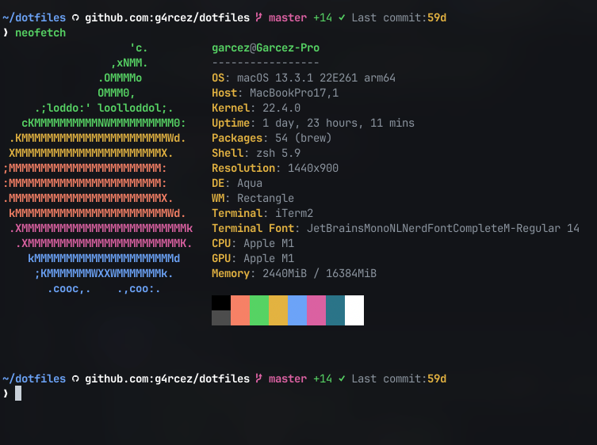

# Awesome Shell

This is a repository with all dotfiles to making a power and awesome Shell

## Desktop Environment

Manjaro Gnome

## Requirements

- [Oh-My-Zsh](https://github.com/robbyrussell/oh-my-zsh)
- [Nerd-Fonts](https://github.com/ryanoasis/nerd-fonts)
- [MyCli](https://github.com/dbcli/mycli)
- [PgCli](https://www.pgcli.com/)

## Wallpaper

Find in [Reddit](https://www.reddit.com/r/wallpapers/comments/c29pfb/2b_nier_automata/)

## Software List

- Screenshot -> [Flameshot](https://github.com/lupoDharkael/flameshot), thx [@barci](https://github.com/flaviobarci)
- Database Management -> [MyCli](https://www.mycli.net/), [PgCli](https://www.pgcli.com/)
- Music -> [Spotify](https://www.spotify.com/br/download/linux/), [Audacious](https://audacious-media-player.org/)
- [Postman](https://www.getpostman.com/)
