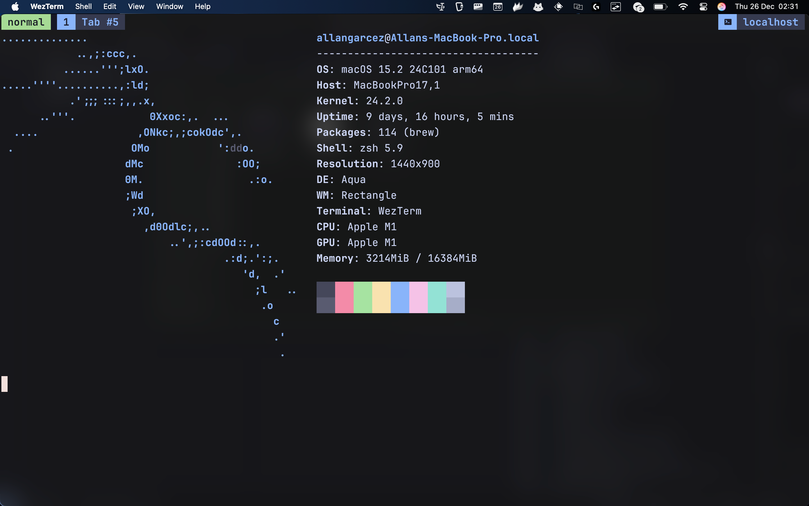

# dotfiles

> A comprehensive, configuration-as-code approach to managing development environment dotfiles with TypeScript/Deno, featuring custom keyboard shortcuts, text expansion, and automated symlink management.



## Features

- 🎹 Custom Keyboard Shortcuts - Programmatic Karabiner Elements configuration with leader keys and modal editing
- 📝 Text Expansion - Espanso integration with dynamic snippets and clipboard management
- 🔗 Automated Symlinks - Smart dotfiles synchronization with custom Deno-based management system
- 🐚 Enhanced Shell - Zsh with modern plugins, fzf integration, and custom functions
- 🚀 Modern Terminal - Wezterm + Zellij/Tmux with session management and layouts
- ⚡ Neovim IDE - Comprehensive Lua configuration with LSP, treesitter, and custom keybindings
- 📦 Package Management - Automated Homebrew package installation and management
- 🎨 Consistent Theming - Catppuccin theme across all applications

## 🛠 Core Technologies

| Tool | Purpose | Configuration |
|------|---------|--------------|
| **Karabiner Elements** | Keyboard remapping & shortcuts | [`karabiner.config.ts`](karabiner.config.ts) |
| **Espanso** | Text expansion & snippets | [`espanso.config.ts`](espanso.config.ts) |
| **Deno** | Configuration management | [`dotfiles.config.ts`](dotfiles.config.ts) |
| **Zsh** | Shell with plugins | [`zsh/`](zsh/) |
| **Neovim** | Text editor | [`config/nvim/`](config/nvim/) |
| **Wezterm** | Terminal emulator | [`config/wezterm/`](config/wezterm/) |
| **Tmux** | Terminal multiplexer | [`config/tmux/`](config/tmux/) |


## What Gets Configured

### Keyboard Shortcuts (Karabiner)

The configuration creates a powerful modal system with Caps Lock as the hyper key:

- **Hyper + hjkl** - Vim-style navigation arrows
- **Hyper + Return** - Tmux leader key bindings
- **Hyper + w** - Window management (Aerospace)
- **Hyper + s** - System controls (brightness, volume)
- **Hyper + v** - Vim mode for system-wide navigation
- **Hyper + r** - Raycast shortcuts
- **Hyper + b** - Browser profile switching

### Text Expansion (Espanso)

Trigger: `;` prefix

- **Social**: `;git`, `;blog`, `;linkedin` - Personal links
- **Utilities**: `;uuid`, `;pass[length]`, `;cpf`, `;cnpj` - Generators
- **Colors**: `;hex`, `;rgb`, `;hsl` - Color conversions
- **Dates**: `;date`, `;time`, `;now` - Date/time insertion
- **Emojis**: `;eyes`, `;s2`, `;blz` - Quick emoji access

### 🐚 Shell Environment

- **Zsh** with Oh My Zsh and modern plugins
- **Starship** prompt with git integration
- **FZF** for fuzzy finding with custom bindings
- **Zoxide** for smart directory jumping
- **Mise** for runtime version management

### ⚡ Terminal Setup

- **Wezterm** with custom theming and zen mode
- **tmux** with project-based session management
- **Integrated file manager** (Yazi)

## Directory Structure

```
dotfiles/
├── bin/                    # Custom scripts and utilities
├── config/                 # Application configurations
│   ├── nvim/              # Neovim configuration
│   ├── wezterm/           # Terminal configuration
│   ├── zellij/            # Terminal multiplexer
│   ├── aerospace/         # Window manager
│   └── ...
├── zsh/                   # Shell configuration
├── dotbot/                # Custom dotfiles management system
├── dotfiles.config.ts     # Main configuration
├── karabiner.config.ts    # Keyboard shortcuts
└── espanso.config.ts      # Text expansion
```

## Configuration Management

This dotfiles system uses a custom TypeScript-based configuration management built on Deno:

### Commands

```bash
# Sync all configurations
deno task dotfiles sync

# Add new file to dotfiles
deno task dotfiles add --target ~/.newfile

# Create symlinks
deno task dotfiles link --from ~/dotfiles/file --to ~/.file

# Install packages
deno task dotfiles pkg neovim --cask

# Migrate existing setup
deno task dotfiles migrate
```

### Plugin System

The system supports custom plugins for:

- **Espanso** - Dynamic snippet generation
- **Karabiner** - Programmatic shortcut creation  
- **VSCode** - Extension and settings management

Example plugin configuration:

```typescript
plugins: [
  espansoPlugin(EspansoRules),
  vscodePlugin({ path: "vscode", extensionsFile: "vscode/extensions.txt" }),
  karabinerPlugin({
    rules: KarabinerConfig.map,
    whichKey: KarabinerConfig.whichKey,
    configFile: "karabiner/karabiner.json"
  }),
]
```

## 🎨 Theming

Consistent **Catppuccin Mocha** theme across:
- Terminal (Wezterm)
- Shell (Zsh syntax highlighting)
- Editor (Neovim)
- File manager (Yazi)
- Directory listings (LSD)

## 🛠 Custom Scripts

Located in [`bin/`](bin/):

- **Session Management**: `tmux-fzf-session`, `zellij-sessionx`
- **Git Utilities**: `git-branch.sh`, `release-cli`
- **System Tools**: `clear-notifications`, `github-icon`
- **Development**: `relative-time-commit`, `fishfy-path`

## Applications

### Development
- **Neovim** - Primary editor with LSP, Treesitter, and modern plugins
- **VSCode** - Secondary editor with synchronized extensions
- **Git** - Enhanced with forgit, fzf integration, and custom aliases

### Terminal
- **Wezterm** - GPU-accelerated terminal with custom config
- **Tmux** - Terminal multiplexer
- **Starship** - Cross-shell prompt with git integration

### Productivity
- **Karabiner Elements** - Advanced keyboard customization
- **Espanso** - Universal text expander
- **Aerospace** - Tiling window manager
- **Raycast** - Spotlight replacement with custom extensions

## 🔧 Customization

### Karabiner - Shortcuts

Edit [`karabiner.config.ts`](karabiner.config.ts):

```typescript
const modKeys = karabiner.createHyperSubLayers({
  // Add new shortcut
  n: { to: [{ key_code: "page_down" }], description: "Page down" },
});
```

My karabiner config was very inspired by [karabiner keybind - mxstbr](https://github.com/mxstbr/karabiner). You can check the Youtube videos below:

- [Max Stoiber Owns His Workflow with Raycast](https://www.youtube.com/watch?v=m5MDv9qwhU8)
- [How I Programed the Most Productive MacOS Keyboard Setup Ever: Karabiner Elements](https://www.youtube.com/watch?v=j4b_uQX3Vu0)

With these videos I have the idea to implement keybindings like Tmux, with a prefix + key. My karabiner config have two modes:

- `single`: that just press one time the prefix + key
- `hold`: you need to hold the prefix until the karabiner notification and press the other key. With this mode you can repeat all keys at layer. Hold
  again to exit from this mode


### Espanso

Edit [`espanso.config.ts`](espanso.config.ts):

```typescript
espanso.insert("mykey", "My expanded text", "Description"),
```

[Espanso](https://espanso.org/) it's an amazing tool to expand your texts to other utilities. I work in frontend and I need a lots of texts like lorem
ipsum or random brazilian documents (CPF/CNPJ) to test some accounts. Since I have some personal information at my espanso config, this file will not
be able to check at this repo. But you can generate using the `make` or check this sample.

The espanso command key is `;`, since I use the `:` for emojis in most applications.

```yaml
matches:
    - trigger: ";cnpj"
      replace: "{{cnpj}}"
      vars:
          - name: "cnpj"
            type: "shell"
            params:
                shell: "bash"
                cmd: "deno ~/dotfiles/espanso/cnpj"
    - trigger: ";date"
      replace: "{{date}}"
      vars:
          - name: "date"
            type: "date"
            params:
                format: "%d/%m/%Y"
    - trigger: ";time"
      replace: "{{time}}"
      vars:
          - name: "time"
            type: "date"
            params:
                format: "%H:%M"
    - trigger: ";youtube"
      replace: "https://www.youtube.com/@allangarcez"
```


### Modifying Shell

Edit files in [`zsh/`](zsh/):
- `alias.sh` - Command aliases
- `exports.sh` - Environment variables
- `functions.sh` - Custom functions

### How to install?

First, check the requirements:

- zsh > v4
- git > v2
- deno >= 2.1.0

```bash
git clone https://github.com/g4rcez/dotfiles $HOME/dotfiles
cd $HOME/dotfiles
bash install
```


## Contributing

1. Fork the repository
2. Create a feature branch
3. Make your changes
4. Test with `deno task dotfiles sync`
5. Submit a pull request

## My Keyboard


## 🙏 Acknowledgments

- [Oh My Zsh](https://ohmyz.sh/) - Zsh framework
- [Neovim](https://neovim.io/) - Modern Vim
- [Catppuccin](https://catppuccin.com/) - Soothing pastel theme
- [Karabiner Elements](https://karabiner-elements.pqrs.org/) - Keyboard customization
- [Espanso](https://espanso.org/) - Text expander

---

⭐ **Star this repo if you find it useful!**

